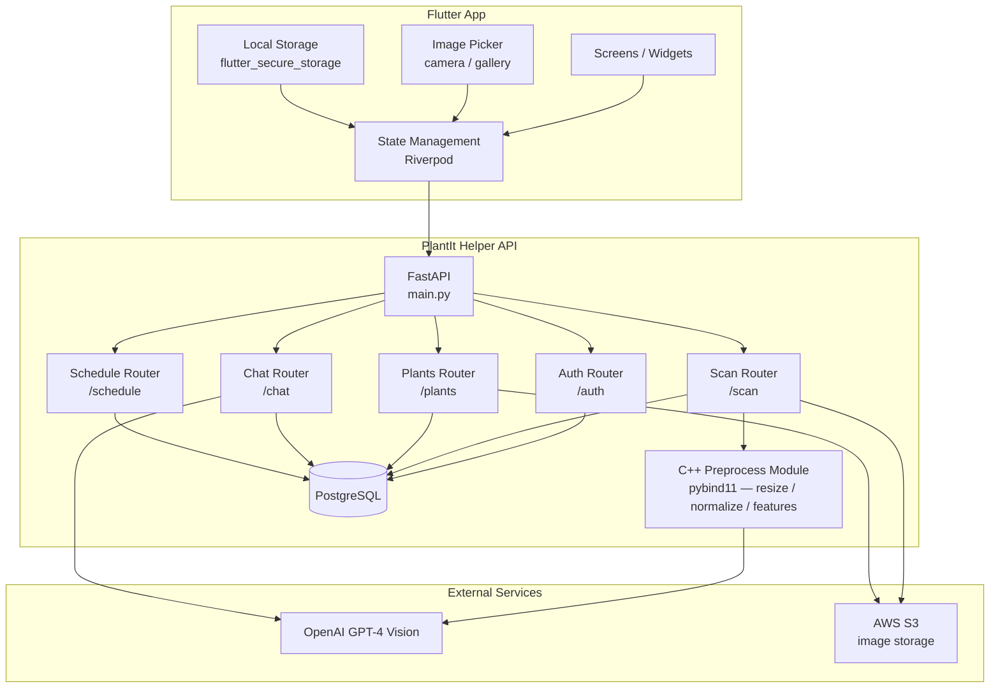
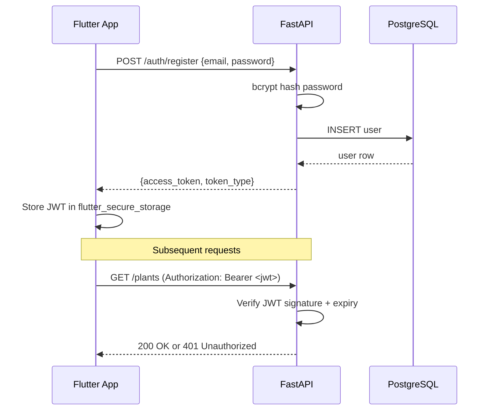
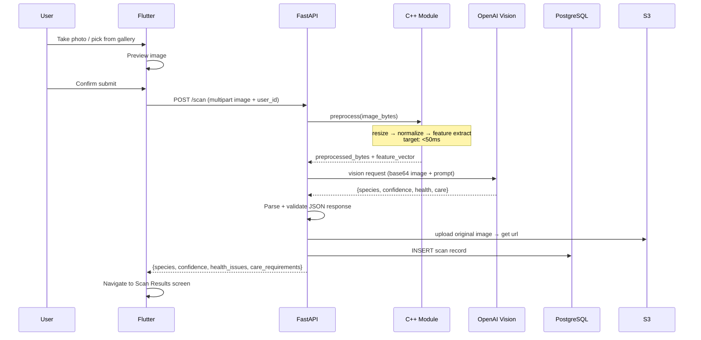
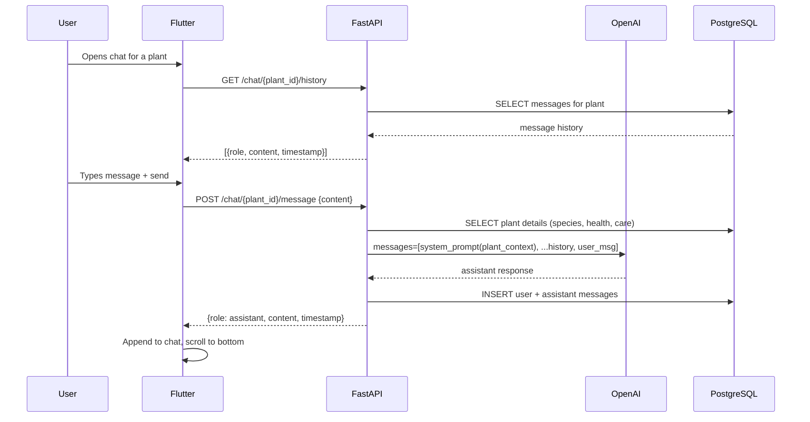
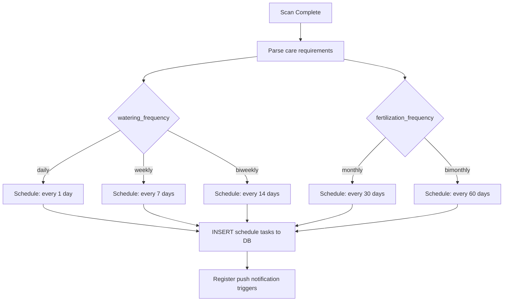
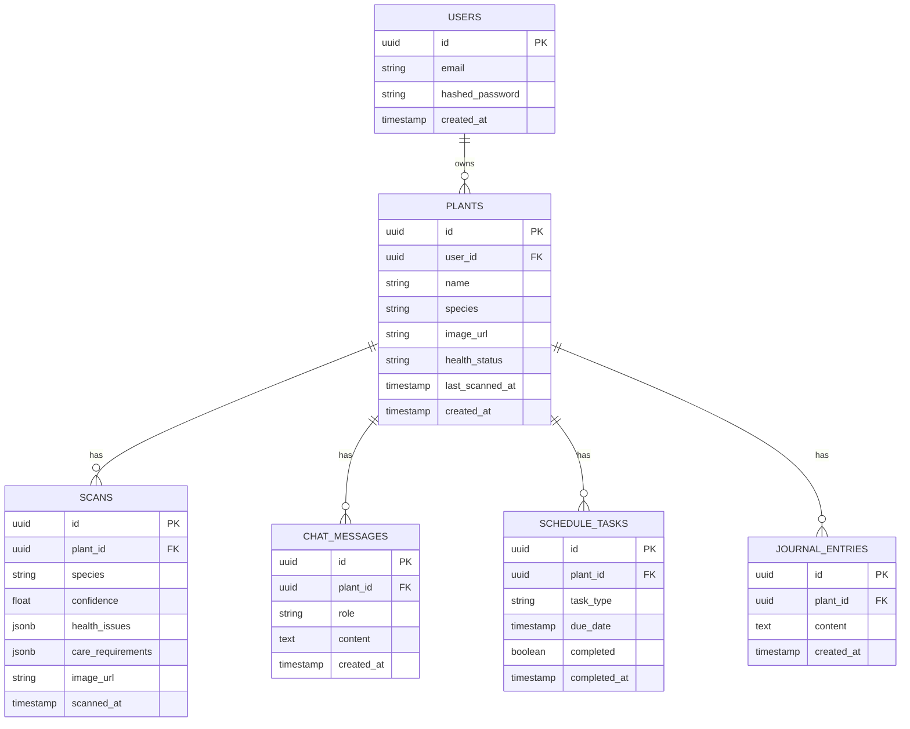

# PlantIt Helper — Architecture

## System Overview

```mermaid
graph TB
    subgraph Flutter App
        UI[Screens / Widgets]
        SM[State Management<br/>Riverpod]
        LS[Local Storage<br/>flutter_secure_storage]
        IP[Image Picker<br/>camera / gallery]
    end

    subgraph PlantIt Helper API
        FE[FastAPI<br/>main.py]
        AUTH[Auth Router<br/>/auth]
        SCAN[Scan Router<br/>/scan]
        PLANTS[Plants Router<br/>/plants]
        CHAT[Chat Router<br/>/chat]
        SCHED[Schedule Router<br/>/schedule]
        CPP[C++ Preprocess Module<br/>pybind11 — resize / normalize / features]
        DB[(PostgreSQL)]
    end

    subgraph External Services
        OAI[OpenAI GPT-4 Vision]
        S3[AWS S3<br/>image storage]
    end

    UI --> SM
    SM --> FE
    IP --> SM
    LS --> SM

    FE --> AUTH
    FE --> SCAN
    FE --> PLANTS
    FE --> CHAT
    FE --> SCHED

    SCAN --> CPP
    CPP --> OAI
    CHAT --> OAI

    AUTH --> DB
    SCAN --> DB
    PLANTS --> DB
    CHAT --> DB
    SCHED --> DB

    SCAN --> S3
    PLANTS --> S3
```

---

## Authentication Flow

```mermaid
sequenceDiagram
    participant App as Flutter App
    participant API as FastAPI
    participant DB as PostgreSQL

    App->>API: POST /auth/register {email, password}
    API->>API: bcrypt hash password
    API->>DB: INSERT user
    DB-->>API: user row
    API-->>App: {access_token, token_type}

    App->>App: Store JWT in flutter_secure_storage

    Note over App,API: Subsequent requests

    App->>API: GET /plants (Authorization: Bearer <jwt>)
    API->>API: Verify JWT signature + expiry
    API-->>App: 200 OK or 401 Unauthorized
```

---

## Plant Scan Pipeline

```mermaid
sequenceDiagram
    participant User
    participant Flutter
    participant API as FastAPI
    participant CPP as C++ Module
    participant OAI as OpenAI Vision
    participant DB as PostgreSQL
    participant S3

    User->>Flutter: Take photo / pick from gallery
    Flutter->>Flutter: Preview image
    User->>Flutter: Confirm submit
    Flutter->>API: POST /scan (multipart image + user_id)

    API->>CPP: preprocess(image_bytes)
    Note over CPP: resize → normalize → feature extract<br/>target: <50ms
    CPP-->>API: preprocessed_bytes + feature_vector

    API->>OAI: vision request (base64 image + prompt)
    OAI-->>API: {species, confidence, health, care}
    API->>API: Parse + validate JSON response

    API->>S3: upload original image → get url
    API->>DB: INSERT scan record

    API-->>Flutter: {species, confidence, health_issues, care_requirements}
    Flutter->>Flutter: Navigate to Scan Results screen
```

---

## Chat Flow

```mermaid
sequenceDiagram
    participant User
    participant Flutter
    participant API as FastAPI
    participant OAI as OpenAI
    participant DB as PostgreSQL

    User->>Flutter: Opens chat for a plant
    Flutter->>API: GET /chat/{plant_id}/history
    API->>DB: SELECT messages for plant
    DB-->>API: message history
    API-->>Flutter: [{role, content, timestamp}]

    User->>Flutter: Types message + send
    Flutter->>API: POST /chat/{plant_id}/message {content}
    API->>DB: SELECT plant details (species, health, care)
    API->>OAI: messages=[system_prompt(plant_context), ...history, user_msg]
    OAI-->>API: assistant response
    API->>DB: INSERT user + assistant messages
    API-->>Flutter: {role: assistant, content, timestamp}
    Flutter->>Flutter: Append to chat, scroll to bottom
```

---

## Care Schedule Generation

```mermaid
flowchart TD
    SCAN_DONE[Scan Complete] --> PARSE[Parse care requirements]
    PARSE --> WATER{watering_frequency}
    PARSE --> FERT{fertilization_frequency}

    WATER -->|daily| W1[Schedule: every 1 day]
    WATER -->|weekly| W2[Schedule: every 7 days]
    WATER -->|biweekly| W3[Schedule: every 14 days]

    FERT -->|monthly| F1[Schedule: every 30 days]
    FERT -->|bimonthly| F2[Schedule: every 60 days]

    W1 & W2 & W3 & F1 & F2 --> INSERT[INSERT schedule tasks to DB]
    INSERT --> NOTIFY[Register push notification triggers]
```

---

## Data Model

```mermaid
erDiagram
    USERS {
        uuid id PK
        string email
        string hashed_password
        timestamp created_at
    }

    PLANTS {
        uuid id PK
        uuid user_id FK
        string name
        string species
        string image_url
        string health_status
        timestamp last_scanned_at
        timestamp created_at
    }

    SCANS {
        uuid id PK
        uuid plant_id FK
        string species
        float confidence
        jsonb health_issues
        jsonb care_requirements
        string image_url
        timestamp scanned_at
    }

    CHAT_MESSAGES {
        uuid id PK
        uuid plant_id FK
        string role
        text content
        timestamp created_at
    }

    SCHEDULE_TASKS {
        uuid id PK
        uuid plant_id FK
        string task_type
        timestamp due_date
        boolean completed
        timestamp completed_at
    }

    JOURNAL_ENTRIES {
        uuid id PK
        uuid plant_id FK
        text content
        timestamp created_at
    }

    USERS ||--o{ PLANTS : owns
    PLANTS ||--o{ SCANS : has
    PLANTS ||--o{ CHAT_MESSAGES : has
    PLANTS ||--o{ SCHEDULE_TASKS : has
    PLANTS ||--o{ JOURNAL_ENTRIES : has
```
